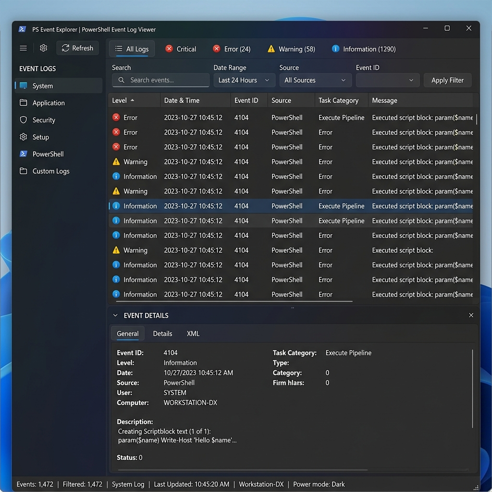

# PSEvents 📜



**PSEvents** is a fast, responsive PowerShell WPF GUI Event Log Viewer for Windows. It provides system administrators and users with a sleek dark-themed console to inspect, search, filter, and export Windows Event Logs (`Application`, `System`, `Security`, etc.).

---

## 🌟 Features

- 🎨 **Dark Minimalist Interface**: Modern WPF interface with color-coded severity indicators for Errors, Warnings, and Information entries.
- 🔍 **Instant Search & Filter**: Filter thousands of event entries by Event ID, Provider/Source, Level, or message text.
- ⚡ **Multi-Threaded Querying**: Non-blocking log reading utilizing background workers for smooth UI performance.
- 📋 **Detailed Event Inspector**: Click any event row to view full formatted message details, stack traces, and XML payload data.
- 📤 **Export Logs**: Save filtered event log sets to CSV or JSON formats for security analysis.

---

## 📋 Requirements

- **Operating System**: Windows 10, Windows 11, or Windows Server 2016+
- **PowerShell**: PowerShell 5.1 or PowerShell 7+
- **Privileges**: Administrator Privileges required to access Security event logs.

---

## 🚀 How to Run

1. Launch PowerShell as Administrator.
2. Navigate to the `PSEvents` directory:
   ```powershell
   cd "c:\AI\Code\New folder\PSEvents"
   ```
3. Run the event viewer script:
   ```powershell
   .\PSEvent-Viewer.ps1
   ```
